# Sparkify ETL with Airflow, Docker, and Terraform

## Project Banner


---

## Table of Contents

* [Project Overview](#project-overview)
* [Architecture](#architecture)
* [Prerequisites](#prerequisites)
* [Setup & Installation](#setup--installation)
* [AWS Infrastructure with Terraform](#aws-infrastructure-with-terraform)
* [Running Airflow with Docker](#running-airflow-with-docker)
* [Redshift Admin Password Fix](#redshift-admin-password-manual-fix)
* [DAG Overview](#dag-overview)
* [Testing & Validation](#testing--validation)
* [SQL Schema & Query Testing](#sql-schema--query-testing)
* [Cleanup & Costs](#cleanup--costs)
* [Troubleshooting](#troubleshooting)
* [Project Structure](#project-structure)
* [Contact](#contact)

---

## Project Overview

This project demonstrates a modern data engineering workflow for Sparkify, using:

* **Apache Airflow** for orchestration
* **Docker Compose** for local development
* **AWS Redshift Serverless** as the data warehouse
* **Terraform** for infrastructure as code
* **Custom Airflow Operators** for staging, loading, and data quality checks

The pipeline extracts, transforms, and loads (ETL) song and event data from S3 into Redshift, following a star schema.

GitHub Repo: [https://github.com/Kareem1990/sparkify-etl-airflow](https://github.com/Kareem1990/sparkify-etl-airflow)

---

## Architecture

```
                +-----------------------------+
                |     Terraform (IaC Tool)    |
                |-----------------------------|
                |  Provisions AWS Resources:  |
                |  - S3 Bucket                |
                |  - Redshift Serverless      |
                |  - IAM Roles/Policies       |
                +-------------+---------------+
                              |
                              v
     +------------------------+--------------------------+
     |                  AWS Cloud Infrastructure         |
     |---------------------------------------------------|
     |  S3 (raw data)     -->    Redshift (data warehouse)|
     +------------------------+--------------------------+
                              ^
                              |
         +--------------------+----------------------+
         |     Airflow (in Docker containers)        |
         |-------------------------------------------|
         | DAG: sparkify_etl_dag                     |
         | - Stage data from S3 to Redshift          |
         | - Load fact & dimension tables            |
         | - Run data quality checks                 |
         +--------------------+----------------------+
                              ^
                              |
         +--------------------+----------------------+
         |    run_all.sh (shell script entrypoint)   |
         |-------------------------------------------|
         | - Installs requirements.txt dependencies  |
         | - Loads .env vars                         |
         | - Runs Terraform init/apply               |
         | - Triggers DAG via CLI                    |
         +-------------------------------------------+
```

---

## Prerequisites

Install the following before running the project:

* [Docker Desktop](https://docs.docker.com/get-docker/)
* [Terraform](https://developer.hashicorp.com/terraform/downloads)
* [AWS CLI](https://docs.aws.amazon.com/cli/latest/userguide/install-cliv2.html) (configured with credentials)
* AWS account with permissions to create Redshift, IAM, and S3 resources

---

## Setup & Installation

### 1. Clone the Repository

```bash
git clone https://github.com/Kareem1990/sparkify-etl-airflow.git
cd sparkify-etl-airflow
```

### 2. Configure Environment Variables

Create a `.env` file with the following:

```dotenv
REDSHIFT_USERNAME=your_redshift_user
REDSHIFT_PASSWORD=your_secure_password
AWS_ACCESS_KEY_ID=your_aws_access_key
AWS_SECRET_ACCESS_KEY=your_aws_secret_key
```

> ⚠️ Never commit this file.

---

## AWS Infrastructure with Terraform

### 1. Initialize & Apply Automatically

Run:

```bash
chmod +x run_all.sh
./run_all.sh
```

This script will:

* Install Python dependencies from `requirements.txt`
* Load `.env` vars
* Run `terraform init` & `terraform apply`
* Trigger the Airflow DAG

**Screenshot:**
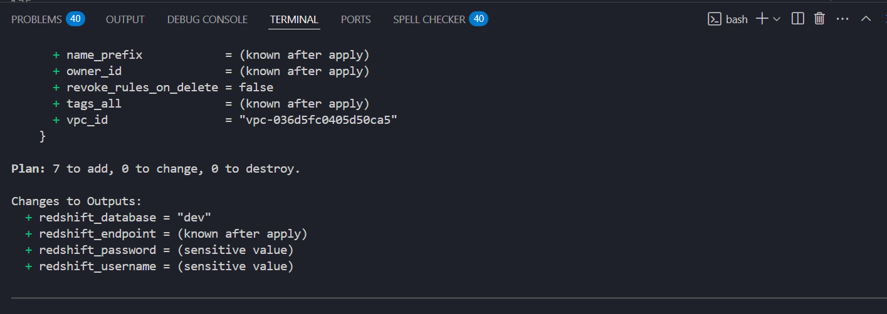

---

## Running Airflow with Docker

### 1. Start Airflow

```bash
docker-compose up --build
```

**Screenshot:**
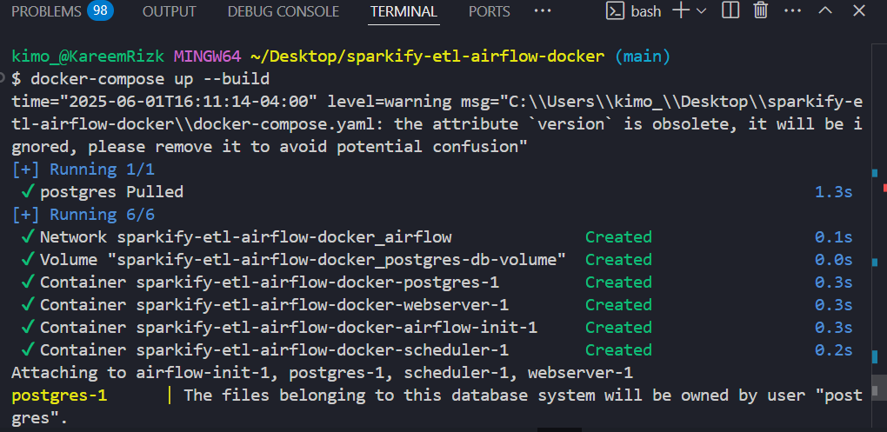

### 2. Access Airflow

Navigate to: [http://localhost:8080](http://localhost:8080)

If prompted to create a user:

```bash
airflow users create \
  --username example_admin \
  --firstname Example \
  --lastname User \
  --role Admin \
  --email admin@example.com \
  --password strongpassword
```

**Screenshot:**
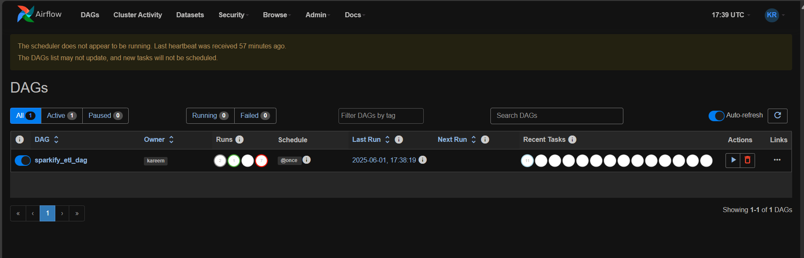

---

## Redshift Admin Password (Manual Fix)

If your Redshift password needs to be manually updated (this is often required **before running the DAG**):

1. Go to AWS Console → Redshift → Workgroup Settings
2. Click "Modify workgroup"
3. Choose "Customize admin credentials"
4. Enter new username/password
5. Save and wait for changes to apply
6. Update the `.env` file with the new password

**Screenshot:**
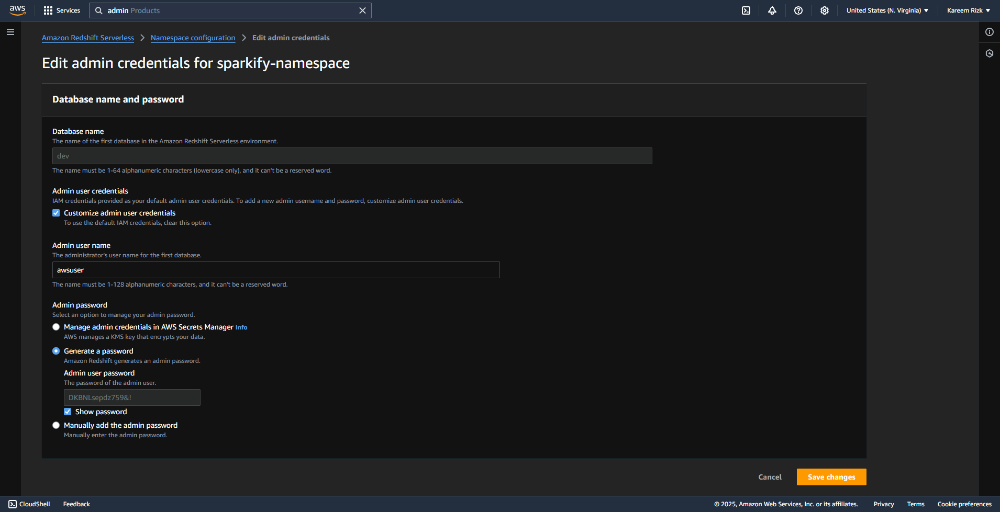

**Connection Dialog:**
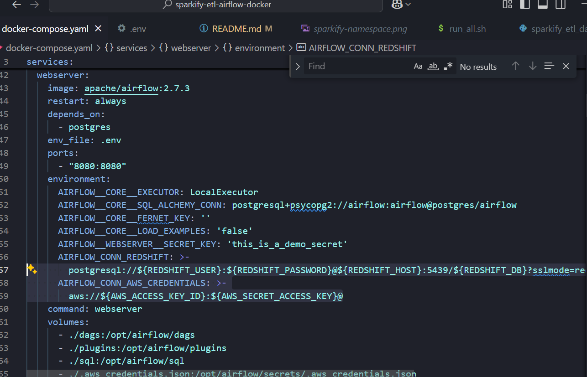

---

## DAG Overview

Main DAG: `sparkify_etl_dag`

Steps:

1. Create Tables – SQL schema in Redshift
2. Stage Events & Songs – S3 to Redshift staging
3. Load Fact Table – `songplays`
4. Load Dimensions – `users`, `songs`, `artists`, `time`
5. Data Quality Checks – Not null & count validations
6. Stop Execution – Dummy task

**Screenshot:**
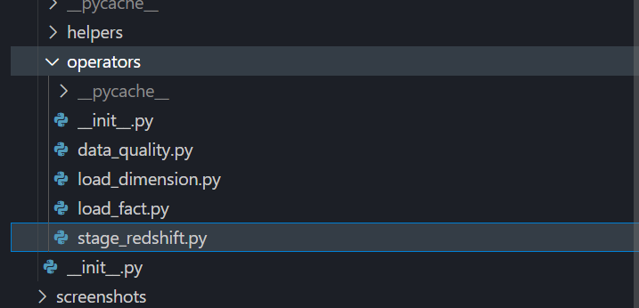
**DAG Success:**
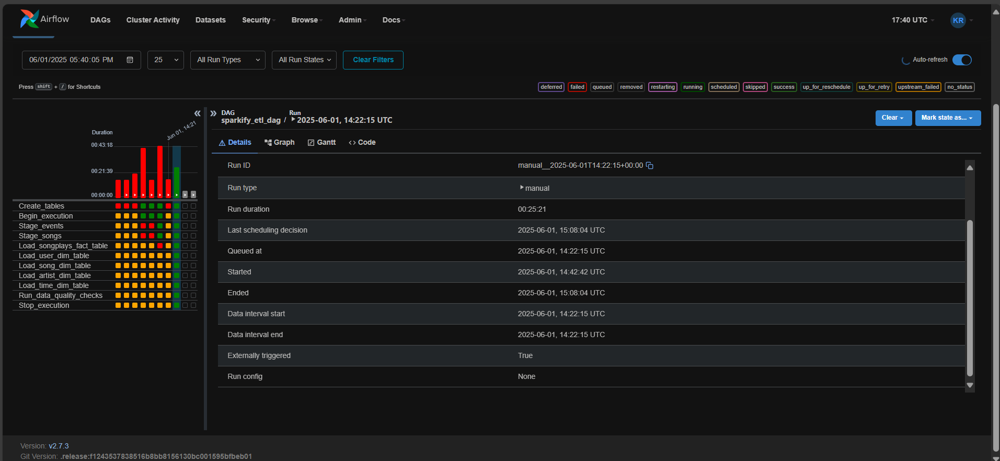

---

## Testing & Validation

### Option 1: Trigger via UI

Click ▶️ in Airflow for `sparkify_etl_dag`.

**Screenshot:**


### Option 2: Manual Task Testing

```bash
docker exec -it sparkify-etl-airflow-docker-webserver-1 bash

# Examples:
airflow tasks test sparkify_etl_dag Load_songplays_fact_table 2025-01-01
airflow tasks test sparkify_etl_dag Load_user_dim_table 2025-01-01
airflow tasks test sparkify_etl_dag Load_song_dim_table 2025-01-01
airflow tasks test sparkify_etl_dag Load_artist_dim_table 2025-01-01
airflow tasks test sparkify_etl_dag Load_time_dim_table 2025-01-01
airflow tasks test sparkify_etl_dag Run_data_quality_checks 2025-01-01
airflow tasks test sparkify_etl_dag Stop_execution 2025-01-01
```

---

## SQL Schema & Query Testing

After running the DAG, you can connect to Redshift Query Editor v2 and run:

```sql
SELECT COUNT(*) FROM users;
SELECT COUNT(*) FROM songplays;
SELECT * FROM songplays LIMIT 10;
SELECT DISTINCT user_id FROM users WHERE level = 'paid';
```

**Screenshots:**

* Linking redshift to the query editor:
  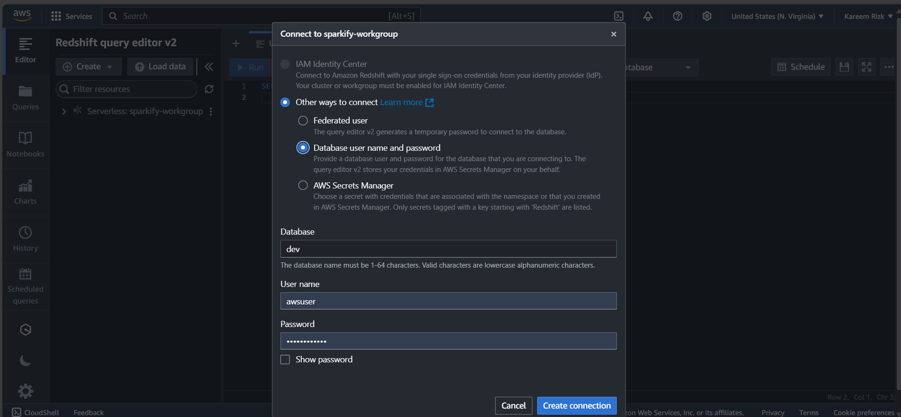
* Users Count:
  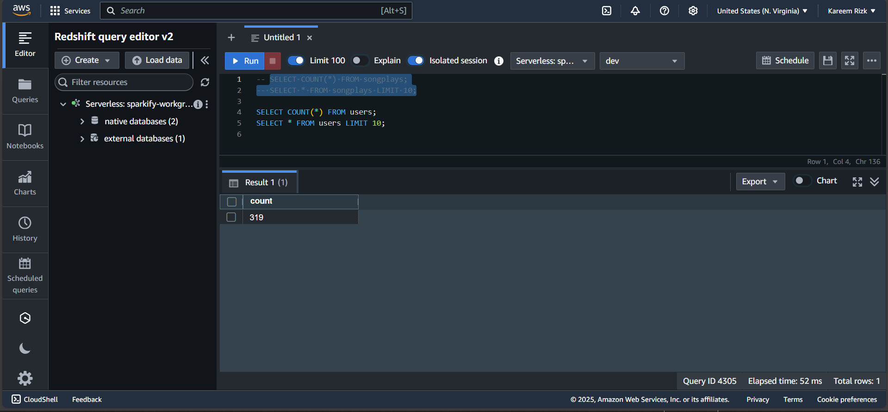
* Songplays Count:
  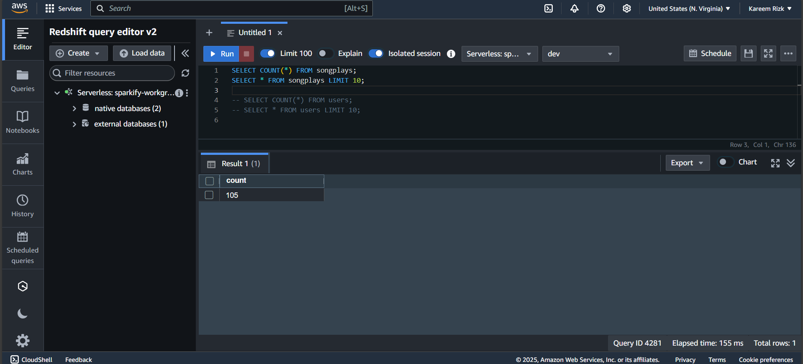
* Songplays Preview:
  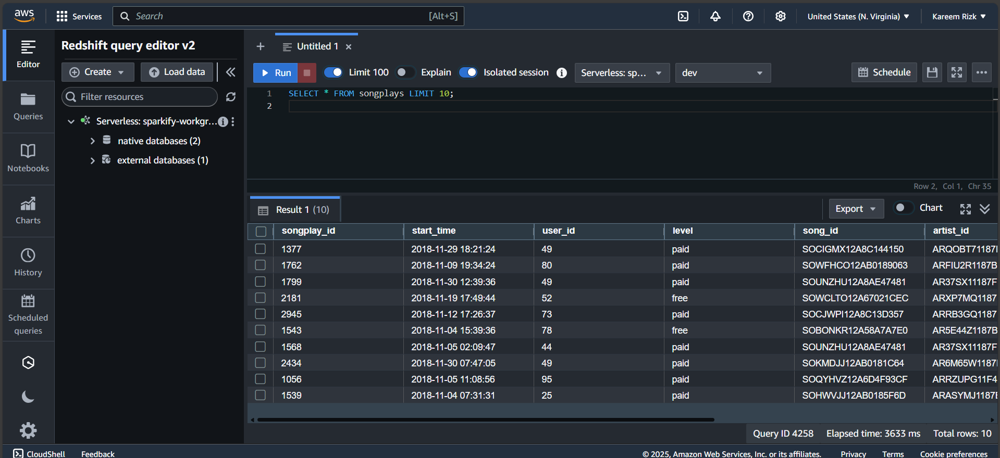

---

## Cleanup & Costs

### Cleanup

To destroy the AWS infrastructure:

```bash
terraform destroy -auto-approve
```

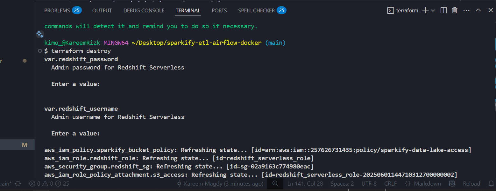

To remove Airflow containers:

```bash
docker-compose down -v
```

To remove DAG from UI:

```bash
# Stop container first
# Then remove the DAG file from /dags and restart
```

### Cost Estimate

If left running, the Redshift Serverless environment may cost **\$1–\$3/day**, depending on usage. Always clean up after testing.

---

## Troubleshooting

* **DAG not visible?** Check `dags/` volume mount and syntax
* **Redshift auth errors?** Fix password via UI and update `.env`
* **S3/permissions?** Validate IAM roles and policies
* **Connection refused?** Retry `docker-compose up --build`
* **Stuck tasks?** Try clearing and re-triggering via UI or CLI

---

## Project Structure

```
├── dags/
├── plugins/
├── terraform/
├── docker-compose.yml
├── Dockerfile
├── .env
├── run_all.sh
├── README.md
```

---

## Contact

For issues or suggestions, open a GitHub issue or email `kareem.magdy5@gmail.com`

---

> ⭐ *This project demonstrates end-to-end data engineering: Infra as Code, orchestration, data warehousing, and custom ETL pipelines.*
